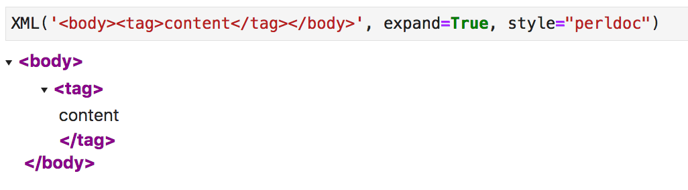

# display_xml
package for distributing a ipython compatible XML displayer

# To install

```
pip install -U display_xml
```

# To use

Import `XML` from `display_xml`.
Call `XML` passing in the object you want to convert in as an argument.


```python
from display_xml import XML
XML('<body><tag>content</tag></body>')
```


You can pass in: 
- `str`
- `bytes`
- `lxml.etree._Element`
- `lxml.etree._ElementTree`

## To display all available styles 

```python
from display_xml import XML
XML.display_all_styles('<body><tag>content</tag></body>')
```


Once you know the style you want, pass that string in as an argument to `XML`:

```python
from display_xml import XML
XML('<body><tag>content</tag></body>', style='perldoc')
```

